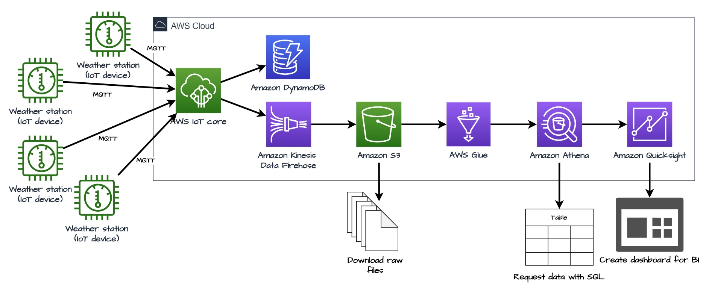

# Création d'un pipeline d'analyse de donnée pour IoT

## 🎯Objectifs 

Ce TP a pour but de mettre en place un pipeline complet d'analyse de donnée IoT.  Les données utilisées proviennent des données de stations météos mise à disposition par la NOAA ([National Oceanic and Atmospheric Administration](https://www.noaa.gov/)). Comme il n'est pas possible de se connecter directement aux stations, vous allez créer des stations fictives qui produiront des données déjà mesurées, à un rythme beaucoup plus rapide que normalement pour avoir rapidement beaucoup de données.

Tout ce pipeline sera déployé sur AWS et mobilisera les services suivants :

- AWS IoT Core pour enregistrer les stations météos et récupérer les messages ;
- Amazon Kinesis Data Firehose pour charger les messages en quasi temps réel ;
- Amazon S3 pour stoker les données ;
- AWS Glue pour découvrir le schéma des données ;
- Amazon Athena pour requêter les données via SQL ;
- Amazon Quicksight pour visualiser les données.

> Tout ce que nous allons mettre en place peut-être mis en place autrement. Mais AWS propose des outils clefs en main ce qui nous permet de pouvoir faire tout cela en peu de temps. Si le service IoT de Google va disparaitre en aout 2023, Microsoft Azure propose une suite IoT et analytics qui pourraient remplacer celles d'AWS dans ce TP. De plus, des solutions open source existent également. Elles seraient par contre trop longue à mettre en place pour un seul TP.

Voici le schéma d'architecture final du TP :



## 🧱Mise en place

1. Récupérez les code du TP sur Git ou Moodle
2. Connectez-vous à AWS Academy et cherchez le service S3. Créez les buckets suivants (ajoutez à chaque fois une suite de caractères pour rendre le nom du bucket unique):
   - iot-tutorial-things-template : c'est ici que le script d'initialisation uploadera les fichiers pour générer les stations météos.
   - iot-tutorial-datalake : Amazon Kinesis Data Firehose dumpera les données ici
   - iot-tutorial-athena-query : c'est dans ce bucket qu'Amazon Athena écrira les résultats de ses requêtes 
3. Cherchez le service AWS IoT Core et dans le menu à gauche cherchez `settings`. Copiez la valeur de votre endpoint dans le fichier .`env` qui se trouve dans le dossier `docker` du TP
4. Cliquez sur votre nom d'utilisateur en haut à droite de la console AWS puis copiez/collez votre account ID dans un bloc-note
5. Installez toutes les dépendances python du TP qui se trouve dans le fichier `requirements.txt` à la racine du TP

## 📱Mon premier objet

Vous allez maintenant créer un objet dans la console d'AWS et faire à la mains les étapes qui seront automatisées par la suite. Cherchez dans le menu `Things` et une fois dessus cliquez sur `Create thing` puis `Create single thing`. Donnez le nom que vous souhaitez à votre objet. Ajoutez si vous le souhaitez un type à votre objet (vous devez alors en créer un) et des attributs. N'ajoutez pas de `shadow` à votre objet. Passez à l'étape d'après. Laissez AWS générer un certificat pour votre objet.

Maintenant nous allons créer une policy qui va déterminer ce que notre objet peut faire. AWS fonctionne avec un principe implicite deny, donc si on ne dit rien, notre objet ne pourra rien faire (pas même envoyer un message). Cliquez sur `Create a policy`, donnez le nom que vous souhaitez, et pour l'action choisissiez `*` et pour la ressource cible `*` également. Valider la policy

>Il ne faut absolument pas faire ça en production ! On vient de créer une policy qui donne tout les droits sur les actions du service IoT. Il faudrait limiter les droits aux actions que nous allons faire, ici se connecter et publier. Mais dans un souci de simplicité cette policy convient très bien pour ce TP.

Retournez sur l'écran de la création de l'objet et créez-le. Téléchargez le certificat de votre objet, les deux clefs, et le certificat Root. Mettez-les dans le  dossier `single-thing` du dossier `single-thing`.

### Connection MQTT avec les outils AWS

Pour réaliser la connexion MQTT entre notre endpoint AWS et notre objet, nous allons utiliser les packages :

- [awscrt](https://pypi.org/project/awscrt/) : AWS Common Runtime pour créer un thread pour exécuter des tâches asynchrone
- [awsiot](https://pypi.org/project/awsiotsdk/) : le sdk AWS IoT pour établir la connexion MQTT

Voici le code de base

```python
from awscrt import io, mqtt
from awsiot import mqtt_connection_builder

# Create a thread for async work
event_loop_group = io.EventLoopGroup(1)
# We use the basic DNS resolver
host_resolver = io.DefaultHostResolver(event_loop_group)
# Scoket creation
client_bootstrap = io.ClientBootstrap(event_loop_group, host_resolver)
# MQTT connection 
mqtt_connection = mqtt_connection_builder.mtls_from_path(
            endpoint=ENDPOINT,
            cert_filepath=PATH_TO_CERTIFICATE,
            pri_key_filepath=PATH_TO_PRIVATE_KEY,
            client_bootstrap=client_bootstrap,
            ca_filepath=PATH_TO_AMAZON_ROOT_CA_1,
            client_id=CLIENT_ID,
            clean_session=False,
            keep_alive_secs=6
            )
print("Connecting to {} with client ID '{}'...".format(
        ENDPOINT, CLIENT_ID))
# Make the connect() call
connect_future = mqtt_connection.connect()
# Future.result() waits until a result is available
connect_future.result()
print("Connected!")
```

Une fois la connection établie, vous pouvez envoyer simplement un message avec la méthode [publish](https://awslabs.github.io/aws-crt-python/api/mqtt.html#awscrt.mqtt.Connection.publish)

```python
mqtt_connection.publish(topic=TOPIC, payload=json.dumps(data), qos=mqtt.QoS.AT_LEAST_ONCE)
```

#### ✍ Hands-on 

Programmez une boucle pour envoyer des messages avec la méthode publish. Maintenant allez sur `MQTT test client`, abonnez vous au topic `hello/world` et lancer le fichier `send_message.py` en vous plaçant bien dans le dossier `single_thing`. L'écran devrait se remplir avec vos message.

## 🚄Création du pipeline

### ⛅Création de la flotte de stations météo

Pour rendre le TP plus réaliste, vous allez créez 5 stations météos fictives. Mais pour AWS elles seront de vrais objets connectés. Pour automatiser ce processus allez dans le dossier `registering-things-in-bulk`, et trouvez le fichier `config.py`. Modifiez la valeur des variables suivantes :

- ROLE_ARN en remplaçant `ACCOUNT_ID` par l'id de votre compte
- BUCKET_NAME en mettant le bucket avec le préfixe `iot-tutorial-things-template`

> Ce script de création d'objet en masse n'est pas de moi et provient du dépôt github suivant https://github.com/yilmaznaslan/aws-iot-core-registering-things-in-bulk. Merci à l'auteur pour le temps gagner à ne pas refaire ce script !

Cherchez également le fichier `.env` qui se trouve dans le dosssier `registering-things-in-bulk/docker/` et modifiez la valeur de `ENDPOINT` avec la valeur de votre endpoint. Laissez tout le reste tel quel.

Placer-vous dans le dossier `scripts` et exécutez le fichier `create_things.py`. Regardez dans la pages `Things` de la console AWS que 5 nouveaux objets sont apparus. Maintenant exécutez le fichier `run_things`. Il va créer 5 conteneurs Docker qui vont publier des données météos en se basant sur des données météorologiques passées. Abonnez-vous au topic `sensor/weather`pour regarder si des données sont bien postées. Si c'est le cas vous êtes bon pour passer à l'étape suivante.

### 📦Mon premier data warehouse : Amazon S3

Dans cette partie nous allez mettre en place la première brique de notre pipeline en stockant vos données. En effet pour le moment les données envoyées ne vont nul part et sont juste perdu. Nous allons utiliser S3 (Simple Storage Service) comme entrepôt de données. S3 est un service de stockage objet, peu cher, sans limite de volume. C'est la meilleure façon de stocker simplement des données (tous les services cloud proposent un services similaire). Par contre il faudra des outils supplémentaire pour requêter nos données.

Pour diriger nos données vers le service S3 nous allons devoir mettre en place une règles pour router nos données. Cliquez sur `Rule` dans la rubrique `Act` puis `Create a rule`. Donnez le nom que vous voulez à votre règle (par exemple `weather_sensor_to_S3`, et une description si vous le souhaitez.

La page suivante permet de déterminer sur quelles données la règles va être appliquée. Cela se fait avec une requête SQL de la forme

```sql
SELECT field1, field2, field3 FROM "topic" WHERE condition
```

Cela permet de routage fin des messages. Par exemple la requête

```SQL
SELECT * FROM FROM "sensor/weather" WHERE wind_speed > 20
```

Permet de router l'intégralité des variables des messages du topic `sensor/weather` si la wind_speed est supérieure à 20. Les messages avec une wind_speed inférieure à 20 ne sont pas affectés par cette règle.

✍ Hands-on : Nous voulons conserver toutes les données de tous les messages. Faite la règles pour respecter cette condition. 

La page suivante permet de définir où sont routées les données. Comme nous nous souhaitons faire un data warehouse en utilisant S3 choisissez l'action `S3 bucket`. Choisissiez le dépôt S3 que vous avez fait en début de TP,  pour le champ key saisissez`${topic()}/${timestamp()` (cela va créer un dossier avec le nom du topic et chaque fichier sera nommé d'après son timestamp de création), et laissez le champ `canned ACL` à private. Enfin pour le IAM role choisissez `LabRole`. Enfin validez votre pipeline, et allez voire dans votre bucket S3.

Vous trouverez arborescence suivante `sensor/weather` avec une myriade de fichiers. 1 par message exactement. Ce comportement n'est pas celui que nous cherchons, car la multiplication des fichiers va entrainer une augmentation des coûts car accéder à un fichier coûte un peu. La solution est nous allons mettre un buffer entre nos messages et notre data warehouse.

### 🚿Charger les messages efficacement : Amazon Kinesis Data Firehose

Le buffer que nous allons utiliser est Amazon Kinesis Data Firehose. KDF est un service serverless d'ETL (Extract, Transform and Load) qui permet d'ingérer et livrer des données dans un data warehouse en quasi temps réel (décalage de l'ordre de la minute). KDF est entièrement managé par AWS, comme IoT core, ce qu'il fait qu'il n'y a aucune infrastructure à gérer et que le service s'adapte automatiquement à nos besoins.

> Comme vous allez le constater l'intégralité des services que nous utilisons dans le TP son serverless. Ces services ont comme avantage premier de permettre de développer rapidement une solution car il ne faut pas réfléchir à la taille de l'infrastructure nécessaire. Par contre, des serveurs sont bien mobilisés chez AWS, nous n'y avons juste pas accès.

Modifiez la règle que vous venez de créer et supprimez son action pour en créer une `Kinesis Firehose stream`, puis créez un stream Firehose. Pour la source sélectionnez `Direct PUT`, et `S3` comme destination. Donnez un nom à ce stream, comme `IoT_warehouse_delievery_stream` et sélectionnez votre bucket S3. Avant de valider, dépliez l'onglet `Advanced Settings`, et dans la partie permissions sélectionnez `Choose existing IAM role ` et `LabRole`. Validez votre stream.

Retournez sur la page de la définition de votre action et sélectionnez le stream que vous venez de créer. Conserver l'option `No separator`. Les messages seront mis bout à bous sur des lignes différentes. Si vous sélectionnez le séparateur `\n` vous aurez des lignes vides dans vos fichiers. Enfin sélectionner le rôle `LabRole`.  Validez tout et attendez quelques minutes. Retourner dans votre bucket et vous devrez voir des dossiers apparaitre. Descendez dans arborescence et téléchargez un des fichiers. Le fichier contiendra plusieurs enregistrement cette fois-ci.

Voilà vous venez de mettre en place la première partie de notre pipeline de traitement à savoir l'acquisition et la persistance des fichiers.

#### ✍ Hands-on : utilisation d'Amazon DynamoDB

Amazon DynamoDB est un service serverless offrant une base de donnée NoSQL. Vous allez stocker certaines données une table DynamoDB.

- Créez une nouvelle règle que vous appellerez `weather_sensor_dynamoDB`

- Pour le filtre SQL, vous allez :

  - Ne conserver que les attributs suivants :

    -  weather_station, 
    - latitude, 
    - longitude, 
    - elevation, time, 
    - air_temperature.value
    - air_temperature.quality
    - wind_speed.value
    - weather_condition, 
    - sky_cover_condition 

    Pour les attributs imbriqués, vous allez devoir les renommer avec un `as` : `parent.child as parent_child`

  - Utiliser le topic précédent

  - Ne prendre que les données où la température est inférieure à -5

- L'action sera une action DynamoDBv2. Comme vous n'avez pas encore de table DynamoDB vous allez en créer une. Donnez lui le nom que vous souhaitez, la partition key sera `weather_station` et la sort key `time`. À elles deux elles formes la clef primaire de la table. Validez la création de votre table, puis retournez dans l'écran de la création de la règle pour la sélectionner. Prenez le rôle IAM LabRole pour cette règle. Validez-là. Puis allez sur l'écran DynamoDB et `Explore items`. Après un certains temps, vous allez avoir des enregistrements qui vont apparaitre.

### 🕷🦸‍♀️Découvrir le schéma de données avec AWS Glue, les requêter avec Amazon Athena

#### 🕷Aws Glue

L'étape suivante de notre pipeline va être de requêter nos données et essayer de produire une information utile. Actuellement nous avons simplement des fichiers json stockés dans un bucket S3, autrement dit, loin d'un format de données facilement requêtable. En python il faudrait par exemple télécharger les fichiers, puis les lire avec un bibliothèque pour ensuite les traiter. Avec de simples fichier dans un bucket S3, nous ne disposons pas du schéma des données ni d'outils pour les requêter. Nous pourrions les charger dans un cluster EMR (Elastic Map Reduce) comme dans les TP précédents (si vous avez le temps vous pouvez essayer), où utiliser une solution encore une fois serverless via AWS Glue et Amazon Athena. AWS Glue est un service d'intégration des données. Il va mettre en forme les données pour qu'un autre service puisse les utiliser. Voici son schéma de fonctionnement.


Le *Data Store* représente nos données. AWS glue permet de configurer un *Crawler* qui va déterminer leur schéma. Une fois le schéma établi, AWS Glue va écrire cela dans votre *Data Catalog* pour permettre aux services Amazon de requêter nos données.

Cherchez le service AWS Glue et cliquez sur `Crawlers` puis `Create crawler`. Comme habituellement, donnez un nom explicite à votre crawler, puis sur la page suivante sélectionnez un source de données de type S3, et trouvez votre bucket. Ne crawlez que les nouveaux dossiers avec un échantillon de 10 fichiers. Nos fichiers vont tous avoir un schéma similaire alors pour accélérer les traitements nous allons en prendre seulement une partie. Sur l'écran suivant sélectionnez le rôle LabRole. Créez une base de donnée pour enregistrer le résultat du crawler, et conserver l'option `On demand` pour le crawler. Valider tout et lancez votre crawler. Il devrez prendre environ 1 min. Vous pouvez maintenant aller sur la page `Tables` et voir qu'une table est apparrue. Si vous cliquez dessus, vous aurez le schéma de votre table.

#### 🦸‍♀️Amazon Athena

Il est maintenant temps de requêter nos données avec Amazon Athena. Cherchez le service Athena. Vous allez arriver une un écran de requêtage. Dans la partie de gauche, sélectionner votre base de données. Une table devrait apparaitre dans la partie `Tables`. Cliquer sur les 3 points horizontaux (cela s'appelle un kebab en UI) puis preview table. Une requête va apparaitre dans l'écran central, exécutez-là. Amazon Athena va vous demander de choisir un bucker pour enregistrer les résultats, choisissez le bucket `iot-tutorial-athena-query-...`

> Si vous obtenez une erreur du type `HIVE_PARTITION_SCHEMA_MISMATCH` il vous faut modifier votre crawler et activer l'option `Update all new and existing partitions with metadata from the table` qui se trouve au step 4 dans les options avancées. Relancé ensuite votre crawler.

Vous pouvez maintenant requêter vos données. Essayez de calculer des indicateurs simples comme la température moyenne, minimale et maximale par station, la même chose par type de condition climatique. Explorer un peu vos données pour vous familiariser avec-elles. Pour rappel, bien que vous puissiez avoir l'impression de manipuler une base de données ce n'est pas le cas. Chaque requête va allez lire vos fichiers json dans votre bucket S3. Mais grâce au schéma déterminé par AWS Glue et le moteur de requête Amazon Athena nous manipulons nos données comme si elles étaient dans une base de données. Le tout avec des outils 100% serverless où l'on paye à l'utilisation (ce qui a des avantages et des inconvénients).

### 📊Visualisation des données avec Amazon Quicksight

#### 📝Mise en forme des données

Avant d'aller plus loin, comme Amazon Quicksight ne peut pas traiter des données non tabulaire, nous allons devoir mettre en forme nos données. Cela va revenir à créer une nouvelle table dans notre base de données à partir de la table que nous avons déjà transformant le schéma. Vous allez faire cela avec une requête de la forme `CREATE TABLE IF NOT EXISTS nom_table AS SELECT ... FROM "database"."table"`. 

Les champs que nous voulons sont :

- Champs directement accessibles :  weather_station, latitude, longitude, elevation, time
- Champs encapsulés dans un autre : air_temperature.value, dew_point.value, wind_speed.value, sea_level_pressure.value, sky_ceiling.value, visibility_distance.value
- Champs de type vecteur qu'il va falloir *unnester* : sky_covover_conction.cloud_type, weather_condition.present_weather_condition. Pour ces derniers vous allez devoir faire des `CROSS JOIN UNNEST(field) AS t(renamed_field)` pour arriver à les *unnester*.

Quand votre table est créée, requêtez là pour voir si tout va bien. Vous pouvez maintenant passez à la partie finale du TP à savoir, visualisez vos données.

#### 📊Quicksight

Amazon Quicksight est un service de *business inteligence* serverless. Il prend la charge la récupération des données et leurs traitements pour créer des dashboards à partir de données diverses. Comme il est serverless il permet de passer à l'échelle facilement. Néanmoins c'est un service cher qui demande un abonnement pour chaque utilisateur du service. Pour ce TP cela ne va pas poser problème, mais la facture peut exploser rapidement en entreprise. D'autres outils de visualisation existent comme [Tableau](https://www.tableau.com/fr-fr) ou [Kibana](https://www.elastic.co/fr/kibana/), mais seraient plus long à utiliser dans notre contexte.

Cherchez le service Quicksight. Il vous faut créer un compte spécifique pour Quicksight. Sélectionnez l'option entreprise, ignorez l'avertissement : "This IAM user or role may not have all the correct permissions...". Pour la méthode d'authentification choisissez "Use IAM federated identities & QuickSight-managed users" et pour le role IAM `LabRole`

Une fois connecté à Quicksight, créez une nouvelle analyse avec le bouton en haut à droite. Sélectionnez `New datasets` puis `Athena`. Donnez le nom que vous souhaitez à votre source, puis sélectionnez votre base de données et enfin la table que vous venez de créer. Importez la dans SPICE et validez.

Une fois sur l'écran de dashboard vous pouvez créez les graphiques que vous souhaitez en drag&dropant les variables dans l'AutoGraph. Avec l'option `ADD` vous pouvez ajouter des visualisations. Créez des visualisations qui vous semblent pertinentes.